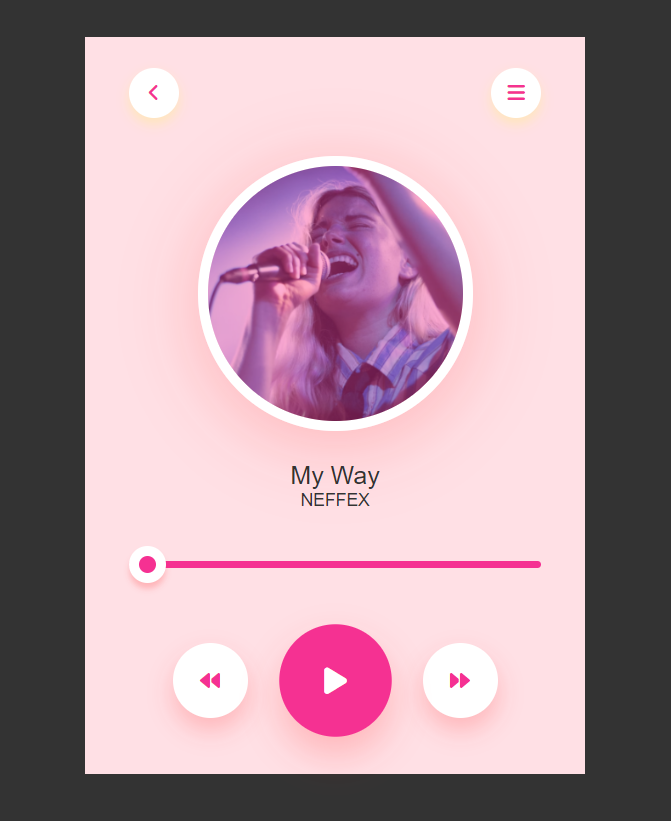

# Music Player 🎵

## Overview
This project is a simple music player that allows users to play, pause, and navigate through a music track. The player displays the song title, artist, and album art. Users can also adjust the progress of the song using a slider.

## Technologies Used 🚀
- **HTML**
- **CSS**
- **JavaScript**
- **Font Awesome Icons**

## Usage 💻
1. **Play/Pause:**
   - Click on the play/pause button to start or pause the music.
2. **Progress Slider:**
   - Use the slider to adjust the progress of the song.
3. **Navigation:**
   - Navigate to the next or previous track using the forward and backward buttons.

## Live Demo 🌐
Live Demo: 

## Installation
No special installation is required for this project. Simply download the project files and open the `index.html` file in a web browser.

## Controls
- **Play/Pause:**
  - Click on the play/pause button or use the spacebar to toggle between play and pause.
- **Next/Previous:**
  - Click on the forward/backward buttons to navigate to the next or previous track.
- **Progress Slider:**
  - Drag the slider to adjust the progress of the song.

## Contributing 🤝
Feel free to use, modify, and contribute to the project! If you have any questions or feedback, you can reach me at nisagokdemir@gmail.com

## License
This project is licensed under the **MIT License**.

